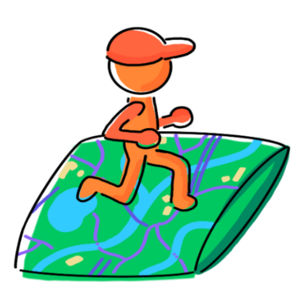
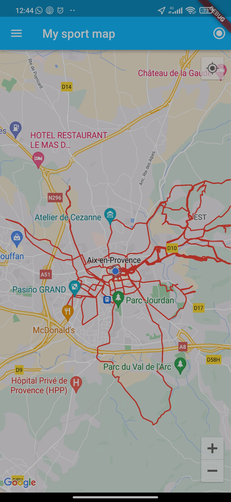

# My Sport Map

![coverage][coverage_badge]
[![style: very good analysis][very_good_analysis_badge]][very_good_analysis_link]
[![License: MIT][license_badge]][license_link]

[](http://commitizen.github.io/cz-cli/)

> Small application to view all your Strava's activities on one map !

This application connects to [Strava](https://www.strava.com/) to fetch all
your sport activities. These activities are then displayed on a single map.

This map can then be used in different ways :
- you can get an overview of your activities over the world
- really useful if like my you like to explore new areas
- can make you remember about nice memories

*This project is a free and open source alternative to the application Sports
Map.*

*Generated by the [Very Good CLI][very_good_cli_link] 🤖*



### Features

These features are implemented by the application :
- displays all your strava's activities on one map
  - each type of activity has its own color
- shows your location on the map

#### Roadmap

Future features :
- filtering activities
- display more information about activities

## Setup the project 🔧

Here are a few steps to setup the project.

*You can skip these and go directly to [Getting Started
🚀](#getting-started-🚀) but you might not get access to Strava if too many
people are using the API key provided. And the map might not be detailed (it
should be ok if you stay in debug mode, ie. if you do not build the app but
just run it).*

### Add Google Maps API key

You will need to add your Google maps API key.

*Note:
You can find the full documentation to use Google Maps with Flutter
[HERE](https://codelabs.developers.google.com/codelabs/google-maps-in-flutter/).*

#### For Android

Add your Google Maps API key in `android\app\src\main\AndroidManifest.xml`.

```xml
<!-- TODO: Add your Google Maps API key here -->
<meta-data android:name="com.google.android.geo.API_KEY"
          android:value="YOUR-KEY-HERE" />
```

To get your API key, follow [these instructions](https://developers.google.com/maps/documentation/android-sdk/get-api-key).

*Note:
It will probably work without an API key but the map precision might not be
optimal.*

### Setup Strava API

You will need to make an Application. According to [Strava
documentation](https://developers.strava.com/docs/getting-started/), follow
these steps :

1. If you have not already, go to https://www.strava.com/register and sign up for a Strava account.
2. After you are logged in, go to https://www.strava.com/settings/api and create an app.
3. You should see the “My API Application” page now. Set the following information :
  - Category: MobileApp
  - Authorization Callback Domain: redirect
  - Optional setup
    - Application name: my_sport_map
    - Application description: Flutter app to see all my activities on one map.

*Note: You can use [this logo](assets/map_logo.png).*

You will now copy your `Client ID` and `Client Secret` into a `lib/secret.dart`
file :

```dart
const String clientId = 'your-client-id';
const String clientSecret = 'your-client-secret';
```

## Getting Started 🚀

This project contains 3 flavors:

- development
- staging
- production

To run the desired flavor either use the launch configuration in VSCode/Android Studio or use the following commands:

```sh
# Development
$ flutter run --flavor development --target lib/main_development.dart

# Staging
$ flutter run --flavor staging --target lib/main_staging.dart

# Production
$ flutter run --flavor production --target lib/main_production.dart
```

_\*My Sport Map as only been tested on Android at the moment._

### Building the app

To build the application run the following command from the project directory :
```sh
# Android AppBundle
$ flutter build appbundle -t lib/main_production.dart

# Android APK
$ flutter build apk -t lib/main_production.dart
```

Now you just have to login and enjoy all your outside activities !

## Running Tests 🧪

To run all unit and widget tests use the following command:

```sh
$ flutter test --coverage --test-randomize-ordering-seed random
```

To view the generated coverage report you can use [lcov](https://github.com/linux-test-project/lcov).

```sh
# Generate Coverage Report
$ genhtml coverage/lcov.info -o coverage/html/

# Open Coverage Report
$ open coverage/index.html
```

## Contributing

Any contribution is welcome ! If you have new feature idea that you would like
to see or if you spot a bug, feel free to open an issue.

And if you want to implement a new feature or fix an issue that would be
awesome.

## License

Distributed under the *MIT license*. See
[`LICENSE`](https://github.com/Nenuphar12/MySportMap/blob/main/LICENSE)
for more information.

## Acknowledgments

Thanks to [dreampowder](https://github.com/dreampowder/) for implementing
[strava_flutter](https://github.com/dreampowder/strava_flutter/), a Strava API
for Flutter.

[coverage_badge]: coverage_badge.svg
[license_badge]: https://img.shields.io/badge/license-MIT-blue.svg
[license_link]: LICENSE
[very_good_analysis_badge]: https://img.shields.io/badge/style-very_good_analysis-B22C89.svg
[very_good_analysis_link]: https://pub.dev/packages/very_good_analysis
[very_good_cli_link]: https://github.com/VeryGoodOpenSource/very_good_cli
