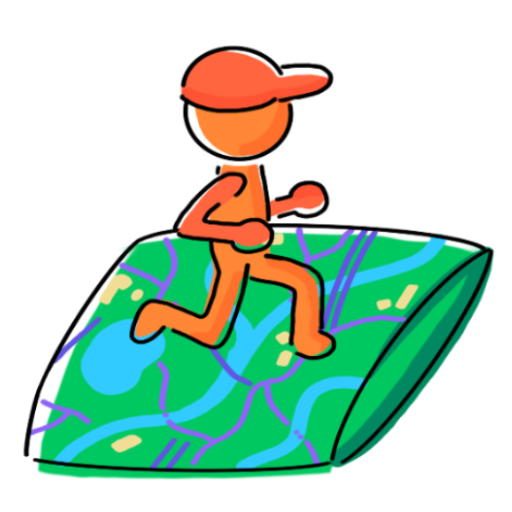
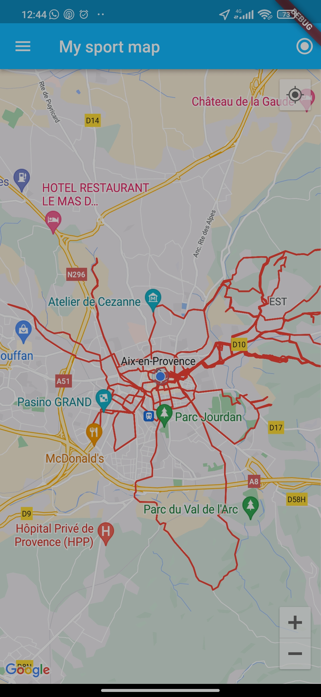

# My Sport Map

[![style: very good analysis][very_good_analysis_badge]][very_good_analysis_link]
[![License: MIT][license_badge]][license_link]
[](http://commitizen.github.io/cz-cli/)

> Small application to view all your Strava's activities on one map !

This application connects to [Strava](https://www.strava.com/) to fetch all
your sport activities. These activities are then displayed on a single map.

This map can then be used in different ways :

- you can get an overview of your activities over the world
- really useful if like my you like to explore new areas
- can make you remember about nice memories

*This project is a free and open source alternative to the application Sports
Map.*

*Generated by the [Very Good CLI][very_good_cli_link] 🤖*



## Features

These features are implemented by the application :

- displays all your strava's activities on one map
  - each type of activity has its own color
- shows your location on the map

### Roadmap

Future features :

- filtering activities
- display more information about activities

## Setup the project 🔧

Here are a few steps to setup the project.

*You can skip these and go directly to
[Getting Started 🚀](#getting-started-🚀) but you might not get access to Strava
if too many people are using the API key provided.*

### 🔐 Setup Strava API

#### 1. Create a Strava API application

According to [Strava's official documentation](https://developers.strava.com/docs/getting-started/):

1. If you haven’t already, [sign up for a Strava account](https://www.strava.com/register).
2. Go to [https://www.strava.com/settings/api](https://www.strava.com/settings/api) and create a new app.
3. Fill in the following fields:
  - **Category:** `MobileApp`
  - **Authorization Callback Domain:** `redirect`
  - *(Optional but recommended)*
    - **Application name:** `my_sport_map`
    - **Application description:** `Flutter app to display all my Strava activities on one map.`
  - You can use [this logo](assets/map_logo.png).

> ℹ️ Note: The callback domain is not used directly by the app — it only needs to match the redirect URL configured in the code.

#### 2. Add Strava API credentials to the app

1. Copy your `Client ID` and `Client Secret` from the Strava API settings.
2. Duplicate `.env.example` and rename it to `.env`
3. Fill in your values:

```env
STRAVA_CLIENT_ID=12345
STRAVA_CLIENT_SECRET=abcd1234...
```

4. Generate the environment configuration:

```shell
dart run build_runner build -d
```

#### 3. ⚠️ Important notes

- **Never commit your `.env` file** or the generated `lib/env/env.g.dart`. These files are already listed in `.gitignore`.
- The `.env.example` file is safe to commit and serves as a template for users.
- All values are loaded securely and obfuscated using the [envied](https://pub.dev/packages/envied) package.

## Getting Started 🚀

This project contains 3 flavors:

- development
- staging
- production

To run the desired flavor either use the launch configuration in VSCode/Android Studio or use the following commands:

```sh
# Development
$ flutter run --flavor development --target lib/main_development.dart

# Staging
$ flutter run --flavor staging --target lib/main_staging.dart

# Production
$ flutter run --flavor production --target lib/main_production.dart
```

_\*My Sport Map as only been tested on Android at the moment._

### Building the app

To build the application run the following command from the project directory :
```sh
# Android AppBundle
$ flutter build appbundle -t lib/main_production.dart

# Android APK
$ flutter build apk -t lib/main_production.dart
```

Now you just have to login and enjoy all your outside activities !

## Running Tests 🧪

To run all unit and widget tests use the following command:

```sh
$ flutter test --coverage --test-randomize-ordering-seed random
```

To view the generated coverage report you can use [lcov](https://github.com/linux-test-project/lcov).

```sh
# Generate Coverage Report
$ genhtml coverage/lcov.info -o coverage/html/

# Open Coverage Report
$ open coverage/index.html
```

## Contributing 🙌

Any contribution is welcome ! If you have new feature idea that you would like
to see or if you spot a bug, feel free to open an issue.

And if you want to implement a new feature or fix an issue that would be
awesome.

For more information check [`CONTRIBUTING.md`](./CONTRIBUTING.md).

## License 📄

Distributed under the *MIT license*. See
[`LICENSE`](https://github.com/Nenuphar12/MySportMap/blob/main/LICENSE)
for more information.

## Acknowledgments ⭐

Thanks to [dreampowder](https://github.com/dreampowder/) for implementing
[strava_flutter](https://github.com/dreampowder/strava_flutter/), a Strava API
for Flutter.

[license_badge]: https://img.shields.io/badge/license-MIT-blue.svg
[license_link]: LICENSE
[very_good_analysis_badge]: https://img.shields.io/badge/style-very_good_analysis-B22C89.svg
[very_good_analysis_link]: https://pub.dev/packages/very_good_analysis
